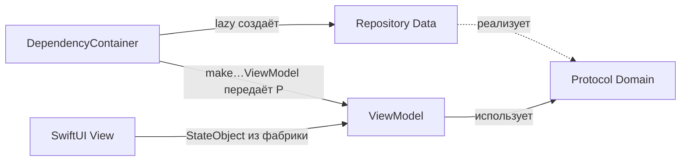

# DI в YoungCon: каркас и связка с протоколами и ViewModel

В коде сейчас только **скелет внедрения зависимостей**: контейнер и проброс в SwiftUI. **Протоколы репозиториев, реализации, ViewModel и фабрики VM** подключаются следующими задачами по этому документу.

---

## Что уже есть в проекте

| Файл | Назначение |
|------|------------|
| `Sources/App/DI/DependencyContainer.swift` | Один класс-контейнер на приложение; пока без сервисов и фабрик. |
| `Sources/App/DI/DependencyInjection.swift` | `EnvironmentValues.dependencyContainer` через `@Entry` (SwiftUI). |
| `Sources/App/YoungConApp.swift` | `DependencyContainer.live()` и `.environment(\.dependencyContainer, …)` на корне. |
| `Sources/Presentation/ContentView.swift` | В превью: `.environment(\.dependencyContainer, .preview)`. |

Любой будущий экран сможет получить контейнер так:

```swift
@Environment(\.dependencyContainer) private var dependencyContainer
```

---

## Что позже кладут в `DependencyContainer`

1. **Инфраструктура** (обычно `private lazy var`):
   - хранение токена (`TokenStorageProtocol` + keychain);
   - `NetworkService` / `AuthorizationProvider`;
   - при необходимости кэши, часы, аналитика.

2. **Репозитории** — поле типа **протокол из Domain**, инициализация **конкретным классом из Data**:
   - `private lazy var eventsRepository: EventsRepositoryProtocol = EventsRepository(network: networkService)`

3. **Фабрики ViewModel** — методы на контейнере (часто `@MainActor`), которые собирают VM и передают в них протоколы, а не конкретные классы:
   - `func makeScheduleViewModel() -> ScheduleViewModel`

Так ViewModel зависит только от абстракций (протоколов), а контейнер — единственное место, где выбирается реализация.

---

## Как связать контейнер, протокол и ViewModel (порядок шагов)



1. **Domain** — объявить протокол, например `EventsRepositoryProtocol`.
2. **Data** — класс `EventsRepository: EventsRepositoryProtocol`, работа с `NetworkService`.
3. **DependencyContainer** — `lazy var eventsRepository: EventsRepositoryProtocol = EventsRepository(...)`.
4. **Presentation** — `ScheduleViewModel` с `init(eventsRepository: EventsRepositoryProtocol)`.
5. **DependencyContainer** — `@MainActor func makeScheduleViewModel() -> ScheduleViewModel { ScheduleViewModel(eventsRepository: eventsRepository) }`.
6. **Экран** — владелец жизненного цикла VM:
   ```swift
   init(container: DependencyContainer) {
       _viewModel = StateObject(wrappedValue: container.makeScheduleViewModel())
   }
   ```

Для превью: отдельный `DependencyContainer.preview` с мок-репозиториями или тот же контейнер с тестовыми дублёрами.

---

## Почему не сторонний DI-фреймворк

Для одного iOS-приложения **Environment + класс-контейнер** достаточно. При росте модульности (SPM) при необходимости можно заменить сборку на Factory / Swinject, не меняя протоколы Domain.

---

## См. также

- Эталон сети и пример репозитория: `YoungCon-DataLayer-ViewModel-Tutorial-And-Reference.md`.
