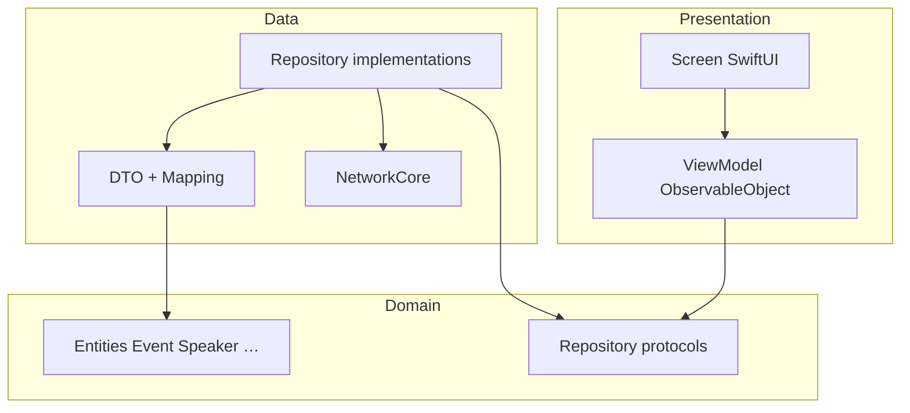

# Архитектура MVVM + DI в YoungCon

Краткий макет для команды: **куда класть код**, **как получать ViewModel**, **какие экраны и VM ждать дальше**.

---

## Схема слоёв



- **View / Screen** — только UI и вызовы `viewModel.…` (в т.ч. `Task { await … }`).
- **ViewModel** — состояние (`@Published`), сценарии, вызов репозиториев через **протоколы** из Domain.
- **Repository** — HTTP через `NetworkService`, маппинг DTO → Entity.

---

## DependencyContainer

- Файлы: `Sources/App/DI/DependencyContainer.swift`, `DependencyInjection.swift`.
- В `YoungConApp` создаётся **один** экземпляр `DependencyContainer.live()` и пробрасывается в дерево SwiftUI:

  `ContentView().environment(\.dependencyContainer, dependencyContainer)`

- Любой экран читает контейнер: `@Environment(\.dependencyContainer) private var dependencyContainer`.

### Правило для ViewModel

Экран **владеет** жизненным циклом VM через `@StateObject`:

```swift
init(container: DependencyContainer) {
    _viewModel = StateObject(wrappedValue: container.makeScheduleViewModel())
}
```

Фабрика `make…ViewModel()` живёт в `DependencyContainer`. Туда же позже добавляются `lazy` репозитории и передаются в `init` ViewModel.

### Превью

`DependencyContainer.preview` — по умолчанию в `EnvironmentKey`; в превью можно явно указать `.preview` или мок-контейнер.

---

## Что уже заведено (вкладки)

| Вкладка   | Screen            | ViewModel            | Зона ответственности (по API) |
|-----------|-------------------|----------------------|--------------------------------|
| Расписание | `ScheduleScreen` | `ScheduleViewModel`  | Фестиваль, события, фильтры, карточки, лайки |
| Карта      | `MapScreen`       | `MapViewModel`       | Этажи, зоны, привязка к карте |
| Бейдж      | `BadgeScreen`     | `BadgeViewModel`     | Профиль, QR, ачивки, лайкнутые события |

`TabPageView` только переключает вкладку и подставляет нужный `*Screen`.

---

## ViewModel, которые логично добавить следующими

Не обязательно отдельный таб; часть — дочерние экраны с навигацией.

| ViewModel (рабочее имя) | Назначение |
|-------------------------|------------|
| `EventDetailViewModel`  | Одно событие + спикеры + лайк |
| `EventCardViewModel`    | Одна карточка в списке (состояние лайка, форматирование времени) |
| `SpeakerDetailViewModel`| Спикер по id |
| `SpeakerListViewModel`  | Список спикеров (если вынесете в отдельный раздел) |
| `LoginViewModel`        | POST `/api/auth/login`, сохранение токена |
| `FestivalPickerViewModel` | Если несколько фестивалей / выбор «текущего» |
| `StaffScanViewModel`    | QR → пользователь, выдача ачивок (роль staff) |

Коллега добавляет VM по шаблону: **протокол в Domain → реализация в Data → фабрика в `DependencyContainer` → Screen с `@StateObject`**.

---

## Чеклист: новая фича с ViewModel

1. **Domain** — сущности уже есть или добавить; протокол репозитория, если нужен новый агрегат API.
2. **Data** — DTO, `EndPoint`, репозиторий.
3. **DependencyContainer** — `lazy var …Repository`, обновить `make…ViewModel(...)` (при необходимости параметры: `id`, `festivalId`).
4. **ViewModel** — `@MainActor`, `ObservableObject`, `@Published`, зависимости только через `init`.
5. **Screen** — `@StateObject`, `init(container:)`, разметка + `.task { await viewModel.onAppear() }` при необходимости.
6. Навигация — подпоток: `NavigationStack`, передача `id` и контейнера в дочерний `Screen` (или фабрика `container.makeEventDetailViewModel(id:)`).
7. **`tuist generate`** после добавления файлов в `Sources/**`.

---

## Где лежат файлы (ориентир)

```
Sources/App/DI/
    DependencyContainer.swift
    DependencyInjection.swift
Sources/Presentation/Schedule/
    ScheduleScreen.swift
    ScheduleViewModel.swift
Sources/Presentation/Map/
    …
Sources/Presentation/Badge/
    …
```

Детальный эталон сети и Events — в `YoungCon-DataLayer-ViewModel-Tutorial-And-Reference.md`.

---

## Почему не Third-party DI

Для одного приложения и Tuist **достаточно** контейнера + `Environment`. Если вырастите модули SPM, можно позже заменить на Factory / Swinject, сохранив протоколы Domain.
