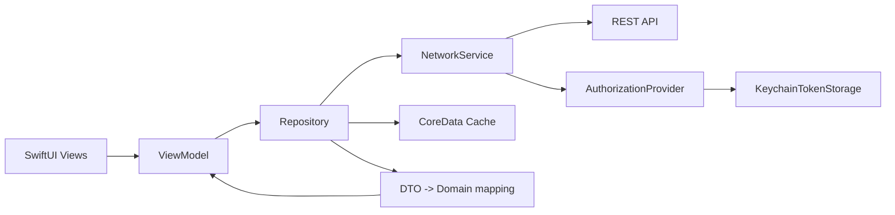

# YoungCon

YoungCon это iOS-приложение для фестиваля или конференции, где в одном месте живут карта площадки, расписание, цифровой бейдж участника, QR-механика и режим организатора для выдачи ачивок.

Проект написан на `SwiftUI`, собирается через `Tuist` и устроен так, чтобы UI был тонким, логика сидела во view model, а данные приходили через репозитории с кешем и сетевым слоем под капотом.

## Что умеет приложение

- показывает карту площадки по этажам и зонам;
- строит расписание событий с фильтрами, лайками и live-пометками;
- отображает бейдж участника с QR-кодом и прогрессом по ачивкам;
- умеет работать в режиме сотрудника: выбрать ачивку, отсканировать QR участника и выдать награду;
- синхронизирует текущую активность события через `ActivityKit`;
- использует локальный кеш, чтобы основные экраны поднимались быстрее и переживали сетевые сбои мягче.

## Как это работает в целом

Поток приложения выглядит так:

1. `YoungConApp` стартует приложение, регистрирует кастомные шрифты и прокидывает `DependencyContainer` в окружение.
2. `ContentView` сначала показывает splash/loading screen, а затем переключает пользователя в корневой flow.
3. `RootView` создает `AppViewModel`, который проверяет, есть ли токен в `Keychain`.
4. Если токена нет или сессия невалидна, показывается `LoginView`.
5. Если сессия валидна, грузится профиль пользователя.
6. По роли пользователя приложение выбирает набор вкладок:
   `client` -> `Карта`, `Расписание`, `Бейдж`
   `employee` -> `Карта`, `Расписание`, `Сканер`
7. `MainTabView` лениво создает feature view model, подгружает данные и запускает нужный polling.

## Архитектура без воды



В проекте используется понятное разбиение по слоям:

- `Presentation` отвечает за UI, состояния экрана и пользовательские сценарии.
- `Domain` хранит сущности предметной области: `Event`, `Floor`, `Zone`, `Achievement`, `UserProfile`, `Speaker`.
- `Data/Network` содержит endpoint'ы, DTO и repository implementation.
- `Data/NetworkCore` это общий сетевой фундамент: `Endpoint`, `URLRequestBuilder`, `NetworkService`, авторизация и обработка ошибок.
- `Data/Storage` отвечает за `Keychain` и `CoreData`-кеш.
- `App` содержит bootstrap, DI, сценарии для тестового запуска и live activity логику.

## Основные фичи по модулям

### Авторизация и сессия

- Логин делает `POST` в `auth/login`, получает access token и кладет его в `Keychain`.
- При старте `AppViewModel` проверяет существующую сессию через `users/myself`.
- Выход дергает `auth/logout` и очищает локальное состояние.
- Bearer-токен в запросы подставляется автоматически через `AuthorizationProvider`.

### Карта

- `MapViewModel` загружает список этажей и для каждого этажа вытягивает зоны.
- Этажи и зоны сортируются, после чего выбирается первый доступный этаж.
- Для карты используется `cacheFirst` на первом заходе и `networkFirst` при обновлениях.
- В фоне карта перепроверяется polling'ом раз в `120` секунд.
- Для UI-тестов есть отдельный сценарий запуска с фикстурой через `--uitesting-map`.

### Расписание

- `ScheduleViewModel` сначала получает последний фестиваль, затем вытягивает события этого фестиваля.
- Параллельно добираются избранные события пользователя, зоны и спикеры.
- На экране доступны фильтры: `Все`, `Live`, `Избранное` и категории событий.
- Лайк события идет через `events/{id}/like`.
- Расписание обновляется polling'ом раз в `30` секунд.
- При изменении данных или возврате приложения в foreground синхронизируется `Live Activity` текущего события.

### Бейдж участника

- `BadgeViewModel` поднимает сразу три источника данных: мой профиль, каталог ачивок и список уже открытых ачивок пользователя.
- На базе этих данных собираются стикеры и состояние бейджа.
- Если прилетает новая ачивка, экран показывает unlock burst-анимацию.
- Для быстрого обнаружения новых наград используется частый polling, сейчас он настроен на `1` секунду.
- QR для бейджа берется из профиля пользователя, а если строка пустая, используется `id`.

### Режим организатора

- Экран организатора доступен только для роли `employee`.
- Сотрудник выбирает ачивку, которую собирается выдавать.
- Затем открывается полноэкранный сканер QR.
- После сканирования сначала резолвится пользователь, затем отправляется запрос на выдачу ачивки.
- Итог сканирования показывает успешное назначение или ошибку.

### Live Activity

- `CurrentEventLiveActivityController` ищет событие, которое идет прямо сейчас.
- Если событие найдено, live activity обновляется или создается заново.
- Если активного события нет, все активные карточки завершаются.
- Для контента live activity используются название события, время, локация и ведущий.

## Как устроены данные и кеш

Кеш в проекте не декоративный, а реально встроен в поток работы.

- Access token хранится в `Keychain` через `KeychainTokenStorage`.
- DTO-данные для расписания, карты и бейджа сохраняются в `CoreDataDataCacheStore`.
- Ключи кеша разнесены по namespace: `schedule`, `map`, `badge`.
- Репозитории поддерживают три политики:
  `cacheFirst` -> сначала пробуем локальные данные;
  `networkFirst` -> сначала сеть, при ошибке fallback в кеш;
  `ignoreCache` -> берем свежие данные и перезаписываем кеш.

За счет этого экран может стартовать быстро, а при временных проблемах с сетью часть данных останется доступной.

## Структура проекта

```text
.
├── Sources
│   ├── App
│   ├── Data
│   ├── Domain
│   ├── Presentation
│   └── Utils
├── Resources
├── SupportingFiles
├── YoungConTests
├── YoungConUITests
├── YoungConLiveActivity
├── Project.swift
└── Tuist/Package.swift
```

Коротко по папкам:

- `Sources/App` -> старт приложения, dependency injection, live activity, test bootstrap.
- `Sources/Presentation` -> все экраны, tab navigation, view model и UI-компоненты.
- `Sources/Data` -> API, репозитории, кеш, keychain, network core.
- `Sources/Domain` -> доменные модели без UI-шума.
- `Resources` -> ассеты, цвета, шрифты.
- `YoungConTests` -> unit tests для map, schedule, badge и части data logic.
- `YoungConUITests` -> UI tests, сейчас в фокусе карта.

## Быстрый старт локально

Каноничный способ поднять проект здесь это `Tuist`. Именно так проект собирается и в CI.

### Что понадобится

- `Xcode`
- `Tuist`
- `SwiftFormat`
- по желанию `xcbeautify` для красивого вывода `xcodebuild`

Если ставить через Homebrew:

```bash
brew install tuist swiftformat xcbeautify
```

### Подготовка проекта

```bash
tuist install --path .
tuist generate --path . --no-open
```

После этого открывай `YoungCon.xcworkspace` и запускай схему `YoungCon`.

## Сборка и тесты

Команды ниже повторяют логику из CI почти один в один.

### Сборка

```bash
xcodebuild build \
  -workspace YoungCon.xcworkspace \
  -scheme YoungCon \
  -destination 'platform=iOS Simulator,name=iPhone 16 Pro' \
  -configuration Debug \
  CODE_SIGNING_ALLOWED=NO
```

### Unit tests

```bash
xcodebuild test \
  -workspace YoungCon.xcworkspace \
  -scheme YoungCon \
  -destination 'platform=iOS Simulator,name=iPhone 16 Pro' \
  -configuration Debug \
  -only-testing:YoungConTests \
  CODE_SIGNING_ALLOWED=NO
```

### UI tests

```bash
xcodebuild test \
  -workspace YoungCon.xcworkspace \
  -scheme YoungCon \
  -destination 'platform=iOS Simulator,name=iPhone 16 Pro' \
  -configuration Debug \
  -only-testing:YoungConUITests \
  CODE_SIGNING_ALLOWED=NO
```

### Форматирование

В `Project.swift` подключен pre-build script со `SwiftFormat`, поэтому при сборке форматтер будет запускаться автоматически, если он установлен в системе.

Проверка вручную:

```bash
swiftformat . --lint --config .swiftformat --swiftversion 6.0 --exclude Tuist,DerivedData,.build
```

## Что уже покрыто тестами

- `MapViewModel`: начальное состояние, сортировка, переключение этажей, ошибки загрузки, кеш.
- `ScheduleViewModel`: успешная сборка расписания, обработка ошибок, конкурентные вызовы.
- `BadgeViewModel`: успешная загрузка, защита от дублирующих запросов, ошибки загрузки.
- `ZoneIconURLClassifier`: отдельная проверка правил для URL иконок.
- `MapUITests`: переключение этажей, отображение зон, попапы и accessibility-элементы карты.

## Важные технические нюансы

- Базовый API URL сейчас захардкожен в `Sources/Data/Network/Constants/APIConstants.swift`.
- В `SupportingFiles/Info.plist` включен `NSAllowsArbitraryLoads`, то есть сетевые ограничения ATS ослаблены.
- Там же `NSCameraUsageDescription` пока пустой, перед реальным релизом его надо заполнить нормальным текстом.
- В репозитории есть папка `YoungConLiveActivity`, но текущий `Project.swift` генерирует только три target'а: `YoungCon`, `YoungConTests`, `YoungConUITests`. Если нужен отдельный extension target для live activity, его надо явно вернуть в Tuist-конфиг.
- В зависимостях проекта подключены `Kingfisher` и `SnapKit`. По коду `Kingfisher` уже используется для загрузки и prefetch изображений.

## Если коротко

`YoungCon` это role-based iOS-приложение для ивента: участник получает карту, расписание и бейдж, сотрудник получает карту, расписание и QR-сканер, а все это держится на `SwiftUI`, `Tuist`, `Keychain`, `CoreData`-кеше и аккуратном слое репозиториев поверх REST API.
